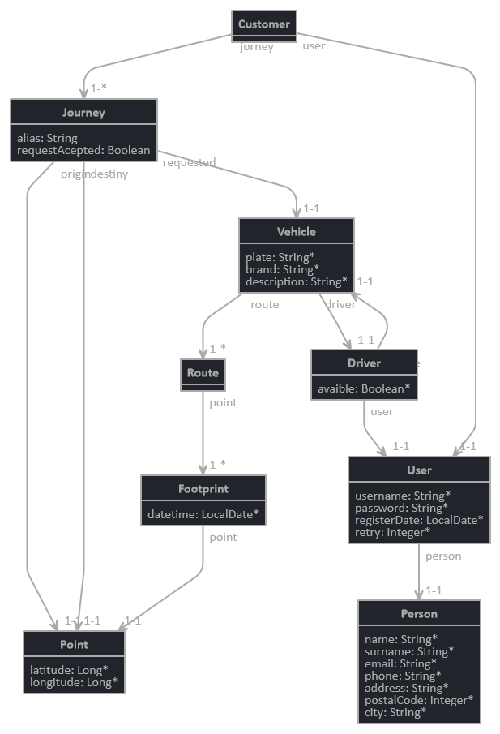

= project requirements
Madrid
:icons: font
:toc: left
:sectnums:
:source-highlighter: coderay
:experimental:

NOTE: Bajo el amparo de las iniciativas _Stop Smoke Sellers_, _Research gives you the Kempston_, _Don't warm up yourself_, _F5 Task is not enough_, _Save the yoghurts_, _Copy&Paste == time waste_ y con fines didácticos se quiere desarrollar un documento de requisitos que describe una sencilla funcionalidad empresarial.

== Resumen
Se quiere construir un Sistema de Información que permita la explotación de un Servicio de Taxi. Una vez registrados en el sistema los dos perfiles básicos, _Driver_ y _Customer_, un customer solicitará un _Journey_ a un _Driver_ para ir desde un _Point_ origen a otro destino. El _Journey_ tiene lugar a través de una _Route_ que visitará una colección de _Points_. Una vez concluido el _Journey_ se emitirá un _Receipt_ con el detalle del servicio. Tanto _Driver_ como _Customer_ disponen de varios _Profile_ que permiten personalizar la oferta y la demanda del servicio.

Por ejemplo, un cliente desea realizar un trayecto desde su domicilio al aeropuerto por la ruta más rápida disponible en el instante que solicita el servicio.

Otro ejemplo, un cliente desear realizar una carrera desde un parque en el que se encuentra con su mascota a su domicilio. Solicita el servicio a aquellos conductores que puedan ofrecerle el servicio.

== Entities
En este apartado se definen las entidades de negocio y sus atributos...

.Model

=== User
Usuario del servicio. En la primera versión podrán ser: Driver, Customer y Owner.

[cols="1,3"options="header"]
|===
|Property
|Description

|id
|Identificador del usuario

|password
|clave de acceso del usuario

|registerDate
|Fecha de registro

|lastLoginDate
|Fecha del último login

|loginAttemptNumber
|Número de reintentos de acceso consumidos

|status
|Estado de la cuenta de usuario (activa, bloqueada, expirada etc.)

|===

[cols="1,3"options="header"]
|===
|Relationship
|Description

|person
|es una persona

|*profile*
|*tiene 1 perfil (TODO)*

|*payment method*
|*tiene N métodos de pago (TODO)*
|===

=== Driver
Conductor de un vehículo que transporta a un cliente desde un lugar a otro.

[cols="1,3"options="header"]
|===
|Property
|Description

|available
|disponibilidad del conductor

|driver license
|Permiso de conducción del reino de España

|expirationDate
|Fecha de caducidad del permiso

|===

[cols="1,3"options="header"]
|===
|Relationship
|Description

|user
|es un usuario

|vehicle
|conduce 1 coche
|===

=== Customer
Persona que contrata un trayecto de taxi. El cliente que contrata el trayecto puede ser distinto a la persona transportada.

[cols="1,3"options="header"]
|===
|Property
|Description
|===

[cols="1,3"options="header"]
|===
|Relationship
|Description

|user
|es un usuario
|===

=== Profile
[red]#TODO:# Serviría por ejemplo para filtrar la colección de vehículos que se muestran a un cliente cuando solicita un trayecto.

=== PaymentMethod
[red]#TODO:# Serviría para indicar los metodos de pago disponibles.

=== Person
Persona Física que representa a un usuario del sistema.

[cols="1,3"options="header"]
|===
|Property
|Description

|name
|nombre del cliente

|surname
|Apellidos del cliente

|email
|correo electrónico

|phone
|Teléfono del cliente

|postalCode
|Código postal

|address
|Dirección del cliente

|city
|Ciudad del cliente
|===

[cols="1,3"options="header"]
|===
|Relationship
|Description

|PaymentMethod
|método de pago elegido por la persona
|===

=== Vehicle
Vehículo con el que el conductor presta el servicio a un  cliente.

[cols="1,3"options="header"]
|===
|Property
|Description

|plate
|matrícula del vehículo

|brand
|marca del vehículo

|description
|descripción detallada del vehículo

|photo
|fotografía del vehículo
|===

[cols="1,3"options="header"]
|===
|Relationship
|Description

|driver
|es conducido por 1 conductor
|===

=== Journey
Representa el trayecto o viaje solicitado por el cliente.

[cols="1,3"options="header"]
|===
|Property
|Description
|alias
|Identificador del trayecto
|requestAccepted
|Indicador de solicitud aceptada por el Driver
|===

[cols="1,3"options="header"]
|===
|Relationship
|Description

|request
|Driver solicitado

|origin
|Punto de partida del trayecto

|destiny
|Punto destino del trayecto
|===

=== Point
Punto de coordenadas terrestre formado por longitude y latitude por el que discurre el viaje o trayecto.

[cols="1,3"options="header"]
|===
|Property
|Description

|latitude
|Latitud geográfica

|longitude
|Longitud geográfica
|===

[cols="1,3"options="header"]
|===
|Relationship
|Description

|route
|forma parte de 1 ruta
|===

=== Route
Colección de puntos que recorre el taxi para prestar el servicio.

[cols="1,3"options="header"]
|===
|Relationship
|Description

|footprint
|está formada por n huellas
|===

=== Footprint o track
Point ubicado en el tiempo. Una colección de footprints forma una ruta.

[cols="1,3"options="header"]
|===
|Property
|Description

|datetime
|Fecha y hora del punto sobre la trayectoria
|===

[cols="1,3"options="header"]
|===
|Relationship
|Description

|point
|Está asociada a 1 punto geográfico de la trayectoria

|route
|forman parte de 1 ruta
|===

== Business rules
[red]#TODO# En este apartado se definen las reglas de negocio que incluyen las validaciones, reglas simples y reglas compuestas por otras reglas...

. Definir la política de asignación de un trayecto a un conductor
. Definir la política de cancelación de un trayecto para un conductor. Definir la política de penalización.
. Definir la política de cancelación de un trayecto para un cliente
. Definir la política de puntos para un conductor. Definir la política de penalización para puntuación igual a cero.
. Definir la política para el cálculo de la tarifa de un trayecto
. Definir la política para mostrar un vehículo disponible

=== FareService
Define la lógica necesaria para cancelar el trayecto y emitir la factura.

=== LocatorService
Define la lógica necesaria para localizar los vehículos.

=== RankingService
Define la lógica necesaria para la valoración y bonificación de conductores y usuarios.

Por ejemplo, un conductor recibe puntos/bonificación por haber devuelto la documentación a un cliente que notificó a Atención al Cliente haberla olvidado en el vehículo.

=== PaymentService
Realiza la comunicación con el Sistema de cobro para los abonos del servicio por parte del Customer.

== Use Cases

=== Registro de <<Driver>> en la aplicación
.Flujo:
. El conductor accede a la pantalla de registro desde el botón del menú de acceso inicial.
. El conductor rellena los datos correspondientes a su perfil.
. El conductor envía los datos informados.
. El sistema valida los datos obligatorios de alta.
. El sistema valida la coincidencia de password's.
. El sistema valida el formato del email.
. El sistema valida el permiso de conducción (Letra del DNI con respecto a dígitos)
. El sistema valida la fecha de renovación.

.Definición del servicio:
.. Endpoint: /v1/drivers/
.. Method: POST
.. Parámetros de entrada:
... <<Driver>>
.. Respuestas:
... https://httpstatuses.com/201[201] - Created al registrar correctamente un conductor
... https://httpstatuses.com/409[409] - Conflict al intentar registrar un conductor existente

=== Registro de <<Customer>> en la aplicación
.Flujo:
. El cliente accede a la pantalla de registro desde el botón del menú de acceso inicial.
. El cliente rellena los datos correspondientes a su perfil.
. El cliente envía los datos informados.
. El sistema valida los datos obligatorios de alta.
. El sistema valida la coincidencia de password's.
. El sistema valida el formato del email.

.Definición del servicio:
.. Endpoint: /v1/customers/
.. Method: POST
.. Parámetros de entrada:
... <<Customer>>
.. Respuestas:
... https://httpstatuses.com/201[201] - Created al registrar correctamente un cliente
... https://httpstatuses.com/409[409] - Conflict al intentar registrar un cliente existente

=== Registro de Vehicle en la aplicación
[red]#TODO#
Definir la regla de negocio para completar la operación.

=== Asignar Driver a Vehicle
[red]#TODO#

=== Login de User
.Enlaces de interés:
. https://stackoverflow.com/questions/3297048/403-forbidden-vs-401-unauthorized-http-responses?rq=1[StackOverflow - Code 401 - Unauthorized response]

.Flujo:
. El usuario (conductor/cliente) debe estar previamente registrado
. El usuario introduce su email
. El usuario introduce su contraseña
. El sistema validad las credenciales
. El sistema actualiza la fecha de último acceso
. El sistema actualiza el contador de accesos
. El sistema muestra la pantalla principal para el usuario

.Definición del servicio:
. Endpoint: /v1/sessions/
. Method: POST
. Parámetros de entrada:
.. <<User>>
. Respuestas:
.. https://httpstatuses.com/401[401] - Unauthorized en login inválido
.. https://httpstatuses.com/302[302] - Found en login válido y redirección a home

=== Solicitar un trayecto por un cliente
. El cliente se autentica en la aplicación
. Se obtiene la posición actual del cliente
. Se solicita el destino
. Se muestra propuesta de vehículos disponibles
. El cliente elige el vehículo para viajar
. El cliente recibe notificación de solicitud aceptada

=== Esperando a ser recogido
. El cliente ha recibido una notificación de solicitud aceptada previamente
. El cliente podrá visualizar durante ese tiempo de espera la posición actual del vehículo elegido

=== Activar disponibilidad por un conductor
. El conductor se muestra como disponible marcándolo desde la aplicación y los clientes lo visualizarán como opción posible.

=== Desactivar disponibilidad por un conductor
. El conductor se marca como no disponible desde la aplicación y los clientes no lo visualizarán como opción

=== Notificar la posición de un conductor
. Periódicamente se envía una colección de footprints al sistema. Existirá una política que calculará el intervalo de tiempo óptimo.

=== Iniciar un trayecto por un conductor
. El conductor recibe una notificación de solicitud de carrera
. El conductor acepta la solicitud y comienza la espera por parte el cliente

=== Finalizar un trayecto por un conductor
. El conductor llega al destino solicitado por el cliente
. El conductor notifica a través de la aplicación que ha llegado a destino
. La aplicación emite la factura correspondiente

=== Cancelar un trayecto por un conductor
. El conductor no puede atender la petición una vez ya ha sido aceptada previamente y por tanto la cancela.
. El conductor debe seleccionar un motivo para la cancelación del trayecto.

=== Cancelar un trayecto por un cliente
. El cliente podrá cancelar el viaje por coste de cero euros si el conductor no ha iniciado su carrera
. En el caso de que el conductor haya iniciado su carrera se le cobrará un recargo de 5 euros

=== Puntuar a un Driver
[red]#TODO#

=== Mostrar la lista de Journeys
. El cliente podrá en cualquier momento visualizar un historial de trayectos que haya realizado con anterioridad.

Se permite un filtro sencillo con rango de fechas.

=== Calcular la Receipt final de un trayecto
. El cálculo de la factura será el número de Km's multiplicado por la tarifa que aplique dependiendo del vehículo elegido

. [red]#TODO# El cálculo de la factura será el número de Km's multiplicado por la tarifa que aplique al perfil del cliente y dependiendo del perfil del vehículo elegido

=== Enviar la Receipt de un trayecto
. Si se ha cancelado por parte del cliente se emite factura de X euros.
. [red]#TODO# Si se ha concluido el trayecto satisfactoriamente se emite factura del precio aplicado al perfil del cliente y dependiendo del perfil del vehículo elegido

=== PaymentMethod
[red]#TODO# Medio de pago por el que los usuarios del sistema abonan los conceptos del servicio.

==== CreditCard

=== Receipt
[red]#TODO# Factura correspondiente al servicio prestado.

=== Almacenar driver en favoritos del customer
[red]#TODO#

=== Obtener la lista de drivers para un customer
[red]#TODO# jena

== URL frontal develop 
Aqui se pueden ver las pantallas https://backoffice-4yf-develop.herokuapp.com/